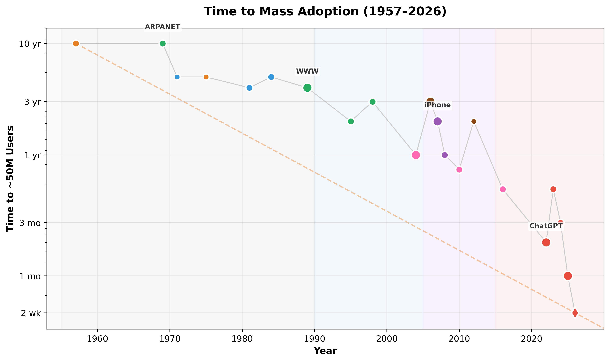

# Plots

Interactive timelines of exponential tech progress – showing growth, compression, and scaling laws enabling modern AI.

## Quick Links

- [AI Compute Timeline (Interactive)](ai-compute-timeline/output/ai_compute_timeline_interactive.html)
- [Adoption Timeline (Interactive)](adoption-timeline/output/adoption_timeline_interactive.html)
- [Energetic Scaling (Interactive)](energetic-scaling/output/energetic_scaling_interactive.html)
- [Civilization Scaling (Interactive)](civilization-scaling/output/civilization_scaling_interactive.html)
- [Energy Leverage (Interactive)](energy-leverage-per-person/export/energy_leverage_interactive.html)

---

## 1. AI Compute Timeline (1900–2026)

Training FLOPs milestones for AI history – from vacuum tubes to frontier models.

- **Interactive**: [View Full Interactive Version (Plotly – Hover/Zoom)](ai-compute-timeline/output/ai_compute_timeline_interactive.html)
- **Static**: [PNG](ai-compute-timeline/output/ai_compute_timeline_highres.png) | [SVG](ai-compute-timeline/output/ai_compute_timeline.svg)
- **Details**: [ai-compute-timeline/](ai-compute-timeline/)


*Zoom recommended for 2010+ frontier cluster (10²⁴–10²⁷+ range).*

---

## 2. Accelerating Paradigms in Computing & Connectivity (1957–2030+)

Time to ~50M users adoption – shows exponential compression from years to days.

- **Interactive**: [View Full Interactive Version (Plotly – Hover/Zoom)](adoption-timeline/output/adoption_timeline_interactive.html)
- **Static**: [PNG](adoption-timeline/output/adoption_timeline_highres.png) | [SVG](adoption-timeline/output/adoption_timeline.svg)
- **Details**: [adoption-timeline/](adoption-timeline/)



*From ~10 years (1957) to ~60 days (2022) – a 60x+ acceleration, with AI pushing toward near-instant scaling.*

---

## 3. Energetic Scaling: Biology vs. Technology

Neural efficiency vs. body size (Biology) and compute efficiency vs. time (Tech) – both reveal power laws.

- **Interactive**: [View Full Interactive Version (Plotly – Hover/Zoom)](energetic-scaling/output/energetic_scaling_interactive.html)
- **Static**: [PNG](energetic-scaling/output/energetic_scaling_highres.png) | [SVG](energetic-scaling/output/energetic_scaling.svg)
- **Details**: [energetic-scaling/](energetic-scaling/)


*Humans are the biological outlier (EQ~7); AI is the technological outlier (75 quadrillion-fold compute/$ since 1939).*

---

## 4. Scaling Civilization: Energy, Coordination, Memory, Replication

Multi-lane log-time timeline showing how four fundamental metrics have scaled from 1M years ago to 2030+.

- **Interactive**: [View Full Interactive Version (Plotly – Hover/Zoom)](civilization-scaling/output/civilization_scaling_interactive.html)
- **Static**: [PNG](civilization-scaling/output/civilization_scaling_highres.png) | [SVG](civilization-scaling/output/civilization_scaling.svg)
- **Details**: [civilization-scaling/](civilization-scaling/)


*Log-time compresses ~99% of human existence (pre-writing) into the left side, expanding modern acceleration on the right. Phase flips (Fire → Agriculture → Writing → Printing → Internet → AI) stack to enable exponential progress.*

---

## 5. Energy Leverage per Person (NEW)

How much total energy does an average human command compared to the metabolic baseline (~114 W)?

- **Interactive**: [View Full Interactive Version (Plotly – Hover/Zoom)](energy-leverage-per-person/export/energy_leverage_interactive.html)
- **Static**: [PNG](energy-leverage-per-person/export/energy_leverage_highres.png) | [SVG](energy-leverage-per-person/export/energy_leverage.svg)
- **Details**: [energy-leverage-per-person/](energy-leverage-per-person/)


*Humans went from ~1–2× body energy (foragers) to ~17× body energy (modern). The post-1750 coal/steam and post-1950 oil/electricity jumps dominate the visual story.*

---

## Why These Plots?

| Timeline | Shows | Trend |
|----------|-------|-------|
| **Compute** | Training FLOPs (10⁰ → 10²⁷) | Exponential **growth** ↑ |
| **Adoption** | Time to 50M users | Exponential **compression** ↓ |
| **Energetic** | Neurons/kg & cps/$ | **Power laws** (log-log linear) |
| **Civilization** | Energy/Coord/Memory/Repl | **Stacking infrastructure** layers |
| **Energy Leverage** | Watts/person vs metabolic | **~17× body energy** (modern) |

Together they illustrate:
- **Compute**: Raw exponential growth enabling AI scale
- **Adoption**: Ecosystem acceleration compressing timelines
- **Energetic**: Fundamental scaling rules – humans and AI as outliers
- **Civilization**: How infrastructure layers (fire → writing → internet → AI) enable each successive leap
- **Energy Leverage**: Per-person energy command from foragers (~2×) to modern (~17×)

Inspired by Kurzweil, [Epoch AI](https://epochai.org/), [Statista](https://www.statista.com/), [Asymco](http://www.asymco.com/), Herculano-Houzel (neuronal scaling), Kleiber (metabolic 0.75), Kaplan/Charnov (LHT/OFT).

---

## Repository Structure

Each plot follows a standardized structure:

```
<plot-name>/
├── index.html              # Interactive page (uses shared/site.css)
├── data/
│   ├── <slug>.csv          # Source data
│   └── meta.json           # Metadata: title, description, fields, sources
├── output/ or export/
│   ├── *_interactive.html  # Plotly interactive chart
│   ├── *_highres.png       # High-res PNG export
│   └── *.svg               # SVG vector export
├── src/
│   ├── *.py                # Matplotlib static generator
│   └── *_plotly.py         # Plotly interactive generator
└── README.md
```

### Shared Assets

- `shared/site.css` – Common styles for all pages
- `shared/site.js` – Navigation bar injection
- `scripts/validate_all.py` – Validate all plots (run: `python scripts/validate_all.py`)

---

## Development

### Install dependencies

```bash
pip install -r requirements.txt
```

### Regenerate all plots

```bash
python build_all.py
```

### Regenerate a specific plot

```bash
cd <plot-name>/src
python <slug>.py           # Static PNG/SVG
python <slug>_plotly.py    # Interactive HTML
```

### Validate all plots

```bash
python scripts/validate_all.py
```

---

## Contributing

Ideas, new milestones, or bug reports welcome! See [CONTRIBUTING.md](CONTRIBUTING.md).

## License

MIT
